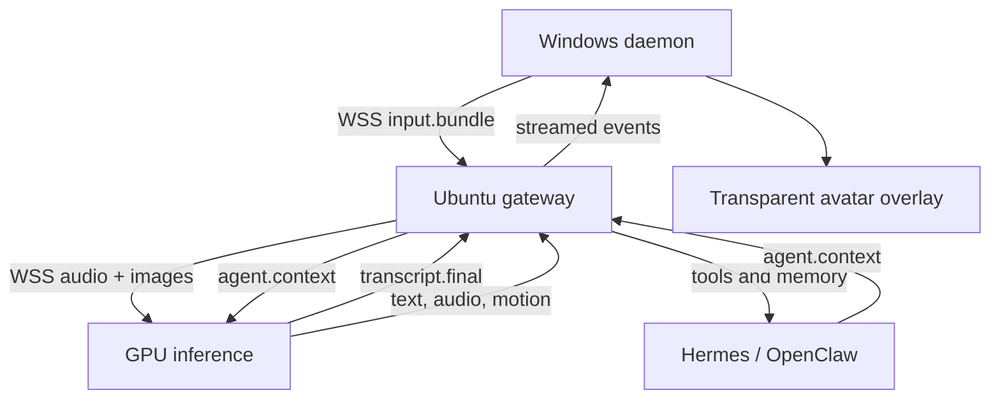

# Architecture

Each utterance owns a `turn_id`. A new speech start emits `response.cancel` for
the active turn, allowing every downstream component to stop work and audio.
The router owns tools and privileges; the GPU service receives only the context
needed to form a response. Secrets are never placed inside event payloads.

## Latency budget

`<600 ms` is an optimization target for time-to-first-feedback, not guaranteed
end-to-end speech completion. Measure `stt_final`, `first_text_token`, first
audio, network RTT and render start independently. Production deployments should
use colocated regions, pre-warmed models, short TTS chunks and binary media frames.

## Avatar behavior

The protocol carries scored expressions, blendshape timelines, gesture intent and
gaze targets. The diagnostic renderer reacts to these values; production-quality
full-body IK and animation blending remain renderer-specific roadmap work.
